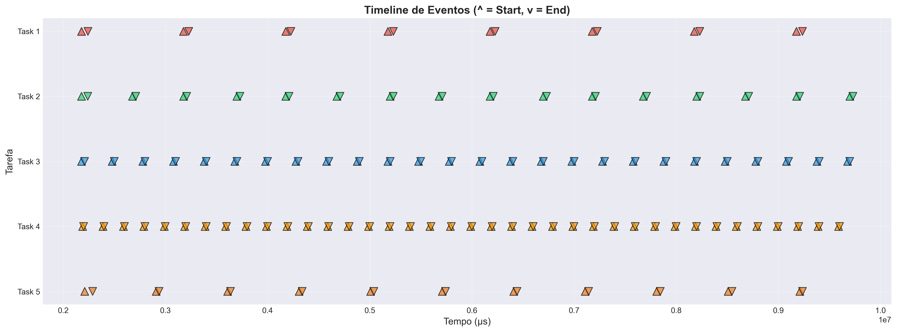
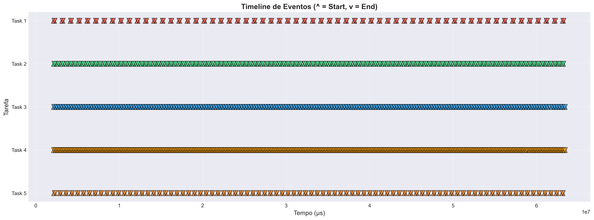
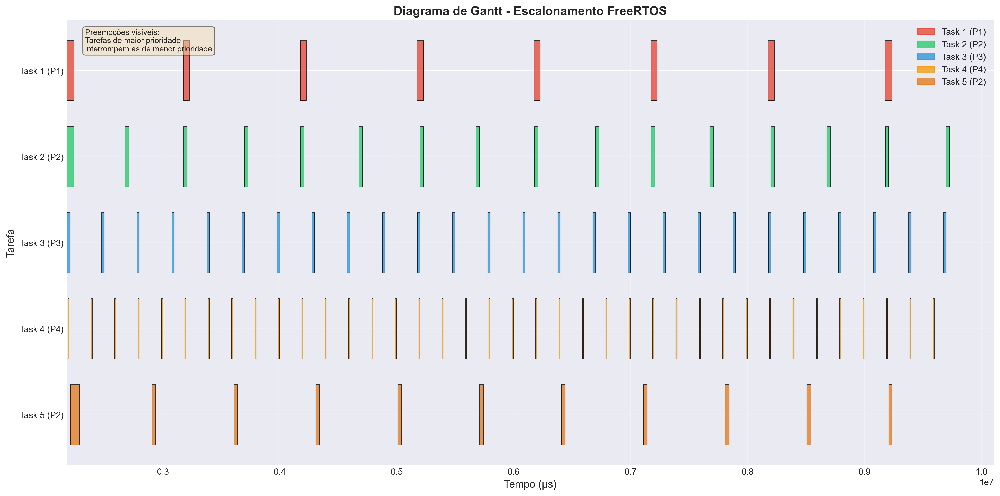
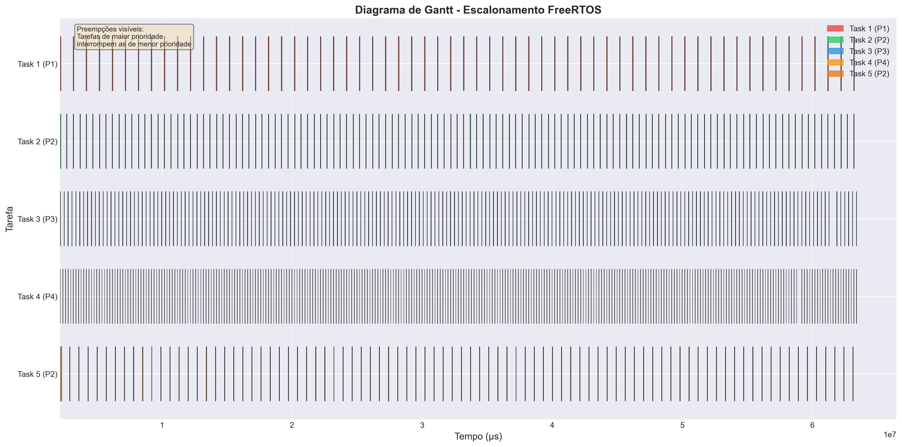
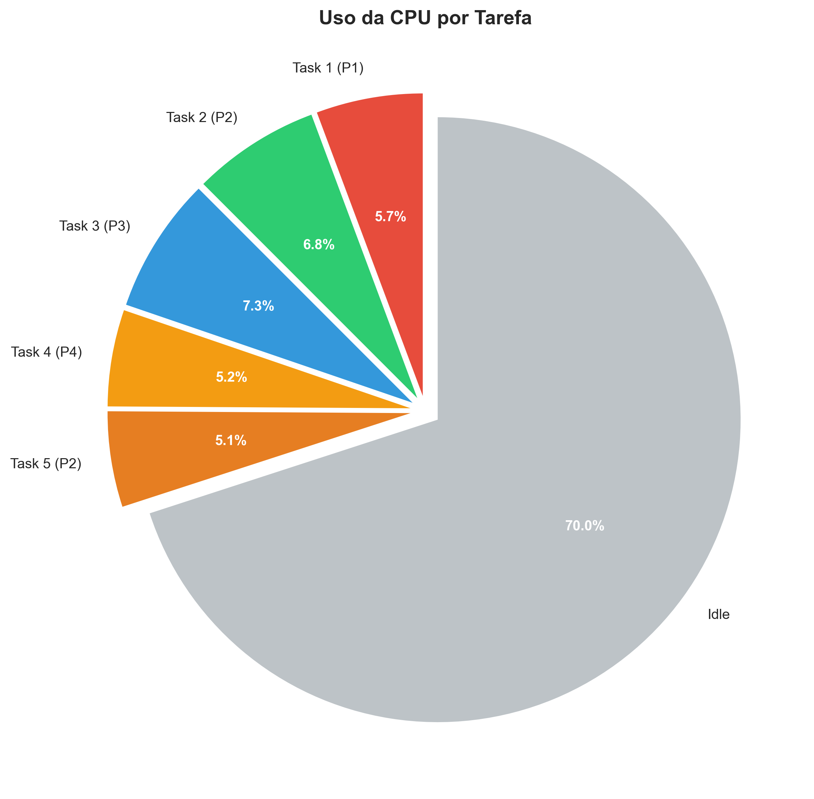
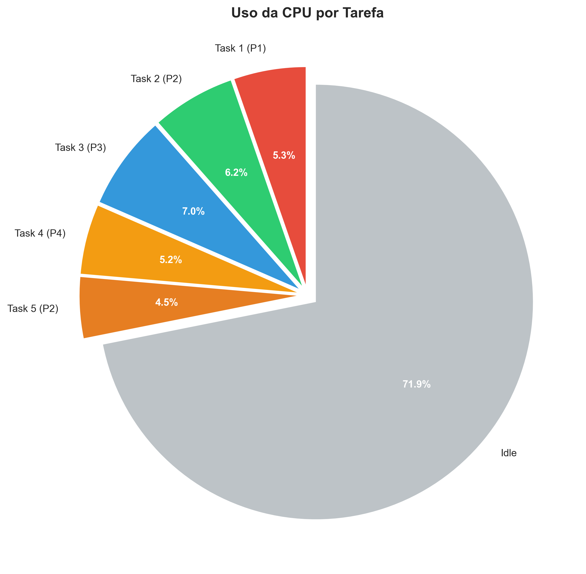
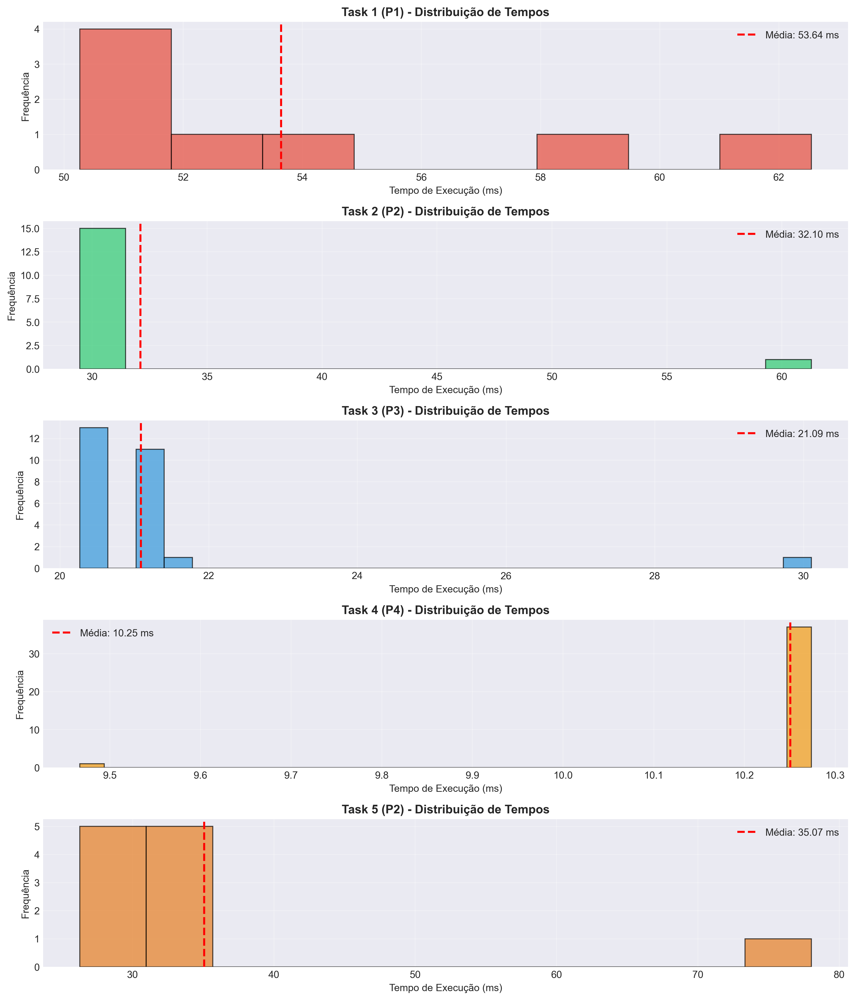
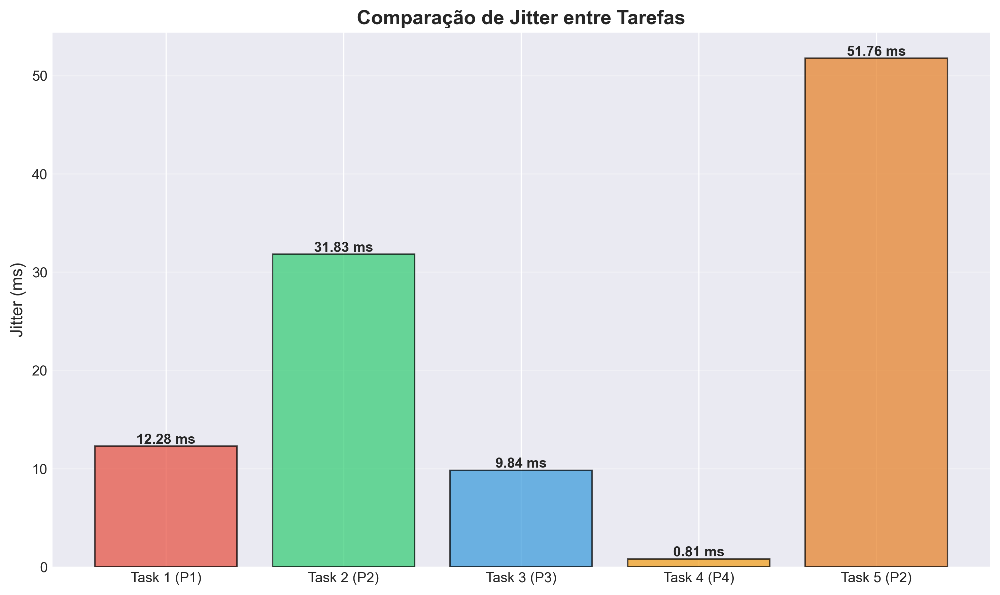
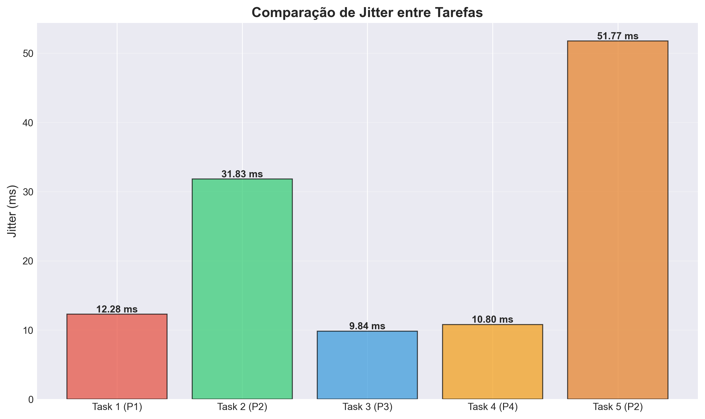

# Relatório do Sistema: ESP32 c/ FreeRTOS Simulado em Wokwi e Analisado em Python

## 1. Dados Gerais

- **Nome**: Laura Righi Boemo
- **Disciplina**: Sistemas Operacionais & Tempo Real
- **Semestre**: 2025/2

## 2. Objetivo Deste Trabalho

### 2.1. Objetivos Gerais

Desenvolver a [_Possibilidade 3_](https://ead06.proj.ufsm.br/pluginfile.php/5435249/mod_resource/content/4/descri%C3%A7%C3%A3o%20do%20projeto%20semestral.pdf), cujos requisitos eram:

1. Projeto monitoração/controle tempo real;
2. Hardware e software a escolha do grupo;
3. Análise temporal de resposta do sistema.

### 2.2. Objetivo Específico

Desenvolver um sistema de monitoração e controle em tempo real usando **ESP32** com **FreeRTOS** nativo enquanto executado no simulador **Wokwi** com indução de escalonamento preemptivo e coleta de dados de execução cuja análise temporal de resposta do sistema é feita via **Python**.

## 3. Detalhes Do Sistema

### 3.1. FreeRTOS & ESP32

No arquivo `esp32_freertos_wokwi.ino`, compilado pelo **ESP32** no simulador **Wokwi**, é possível conferir a **configuração de tarefas periódicas**. Cinco tarefas apresentam diferentes prioridades (Baixa, Média, Alta e Crítica) e períodos (1000 ms a 200 ms), a fim de simular cargas de CPU para observar preempções, por meio das funções nativas de **FreeRTOS** (como xTaskCreatePinnedToCore, vTaskDelay ou pdMS_TO_TICKS).

Uma vez que o código é executado no simulador, é possível conferir sua execução por meio dos leds simulados (gerados em `diagram.json`). Além disso, em seu console há a **instrumentação de tempo real**, onde cada tarefa registra eventos de início/fim em microsegundos e mantém estatísticas (média, mínimo, máximo e jitter) durante a execução. Assim, uma função de monitor imprime periodicamente o uso de CPU/heap e estatísticas de cada tarefa; ao final do período de coleta, gera um log CSV para análise externa (`events.csv`).

### 3.2. Python & Análise

Uma vez que os dados gerados pelo simulador estejam recolhidos em `events.csv`, é posssível executar o código de **análise temporal offline** com `analyze.py`. Dessa forma, são calculados tempos de execução, jitter, uso de CPU e gráficos (Gantt, histogramas e timeline) a partir do CSV coletado.

## 4. Funcionamento Geral
1. No `setup()`, o ESP32 configura GPIOs para LEDs das tarefas, inicializa estatísticas e cria as cinco tarefas + monitor.
2. Cada tarefa executa uma carga de trabalho definida por período/prioridade; tarefas de maior prioridade podem **preemptar** as de menor prioridade, evidenciando escalonamento preemptivo do FreeRTOS.
3. A função `logEvent` grava cada início/fim (`S`/`E`) no buffer `events`, permitindo reconstruir a linha do tempo em microsegundos.
4. A **tarefa de monitoramento** (`MonitorTask`) imprime estatísticas a cada 10s e, após 60s, desativa o log, imprime o CSV e sinaliza o fim da coleta.
5. O CSV copiado do Serial Monitor é processado com `python3 analyze.py wokwi/events.csv`, produzindo gráficos e tabela de desempenho para o relatório de tempo real.

## 5. Avaliação dos Resultados

Para cada métrica, foram geradas visualizações separadas para os cenários com ~200 eventos (`dados-200`) e ~1500 eventos (`dados-1500`). Além de comparar os dois perfis de carga, cada subseção abaixo explica o significado do gráfico correspondente.

### 5.1. Linha do tempo de eventos (timeline)

A timeline coloca cada início (`S`) e término (`E`) das tarefas em um eixo de tempo contínuo, permitindo enxergar **preempções** (quando uma tarefa mais prioritária interrompe outra) e lacunas de ociosidade do processador.

- **dados-200/timeline.png**: a sequência de pontos mostra ciclos mais espaçados, com 198 eventos e 99 execuções completas; a menor densidade facilita identificar intervalos ociosos entre ativações.
- **dados-1500/timeline.png**: a marcação é muito mais densa, com 1500 eventos/783 execuções completas, refletindo o aumento de carga. As interrupções são mais frequentes, mas as ordens de prioridade continuam respeitadas.

| dados-200 | dados-1500 |
| --- | --- |
|  |  |

### 5.2. Diagrama de Gantt

O diagrama de **Gantt** representa visualmente qual tarefa ocupou a CPU em cada intervalo, destacando a duração relativa dos slots de execução e as trocas de contexto provocadas pelo escalonador preemptivo.

- **dados-200/gantt_chart.png**: os blocos são mais longos e separados, evidenciando preempções pontuais quando tarefas de prioridade P4/P3 substituem tarefas de menor prioridade.
- **dados-1500/gantt_chart.png**: os blocos são mais curtos e consecutivos, indicando um sistema quase sempre ocupado. A prioridade elevada ainda garante que tarefas críticas retomem a CPU rapidamente.

| dados-200 | dados-1500 |
| --- | --- |
|  |  |

### 5.3. Uso de CPU

O gráfico de **uso de CPU** mostra o percentual de tempo em que o processador esteve executando tarefas (incluindo períodos de preempção). Cada linha/área corresponde à contribuição acumulada das tarefas listadas nas estatísticas.

- **dados-200/cpu_usage.png**: a soma das tarefas estabiliza perto de 30% (5,7% + 6,8% + 7,3% + 5,2% + 5,1%), deixando ociosidade perceptível.
- **dados-1500/cpu_usage.png**: a distribuição é semelhante (≈28%), mas com menos flutuações por conta da maior cadência de ativações; o sistema permanece ocupado por mais tempo, porém sem saturar a CPU.

| dados-200 | dados-1500 |
| --- | --- |
|  |  |

### 5.4. Tempos de resposta

Os **tempos de resposta** indicam quanto cada tarefa leva entre o início e o fim de uma execução. As médias, mínimos e máximos refletem a influência de preempções e do tempo próprio de computação.

- **dados-200/response_times.png**: as médias variam de ~10 ms (Task 4) a ~54 ms (Task 1), com máximos chegando a 78 ms na Task 5 (P2); a variabilidade é maior nas tarefas de prioridade intermediária.
- **dados-1500/response_times.png**: as mesmas faixas são preservadas mesmo com mais repetições (e.g., Task 1 com média 52,6 ms e Task 5 chegando a 78 ms), mostrando consistência temporal sob carga ampliada.

| dados-200 | dados-1500 |
| --- | --- |
|  |  |

### 5.5. Comparação de jitter

O **jitter** mede a variação do tempo de resposta entre execuções sucessivas (quanto menor, mais determinístico). É especialmente útil para avaliar a previsibilidade de tarefas periódicas.

- **dados-200/jitter_comparison.png**: Task 4 apresenta jitter mínimo (0,81 ms), enquanto Task 5 chega a ~51 ms, indicando maior incerteza em tarefas médias.
- **dados-1500/jitter_comparison.png**: o jitter da Task 4 aumenta (10,80 ms) devido ao volume de eventos, mas Task 5 mantém o valor máximo (~51,8 ms); a hierarquia de previsibilidade entre tarefas permanece similar.

| dados-200 | dados-1500 |
| --- | --- |
|  |  |

## 6. Bônus: Como executar
1. Abrir o [projeto no Wokwi](https://wokwi.com/projects/449086123858100225) e iniciar a simulação por **60 segundos completos** até a mensagem "COLETA DE DADOS CONCLUÍDA".
2. Copiar o bloco CSV do Serial Monitor para `wokwi/events.csv` no repositório.
3. Criar um ambiente virtual Python e ativá-lo:
   - Linux/macOS: `python3 -m venv .venv && source .venv/bin/activate`
   - Windows (PowerShell): `py -m venv .venv; .venv\\Scripts\\Activate.ps1`
4. Instalar as dependências de análise dentro do ambiente: `python3 -m pip install -r pythonrequirements.txt`.
5. Rodar `python3 analyze.py wokwi/events.csv` para gerar gráficos e tabelas.